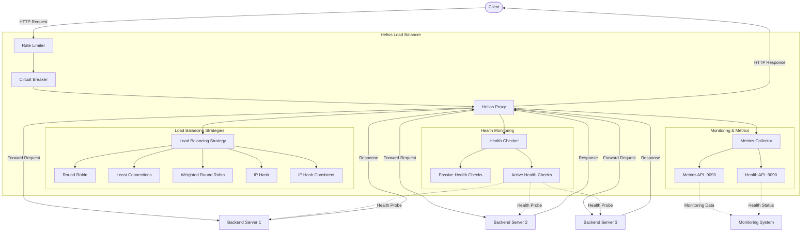

# Helios

<div align="center">

[](https://goreportcard.com/report/github.com/0xReLogic/Helios)
[](https://github.com/0xReLogic/Helios)
[](https://github.com/0xReLogic/Helios/blob/main/LICENSE)
[](https://pkg.go.dev/github.com/0xReLogic/Helios)
[](https://github.com/0xReLogic/Helios/actions)

</div>

Ultra-fast, production-grade L7 reverse proxy and load balancer - simple, extensible, and reliable.

## Overview

Helios is a modern, production-grade reverse proxy and load balancer for microservices. It combines intelligent routing (Round Robin, Least Connections, Weighted, IP Hash), active/passive health checks, low-overhead WebSocket/TLS termination, runtime control via the Admin API, and a pluggable middleware system delivering high throughput, low latency, and effortless operations.

## Features

- **HTTP Reverse Proxy**: Efficiently forwards HTTP requests to backend servers
- **WebSocket Proxy**: Full support for proxying WebSocket connections with connection pooling
- **TLS/SSL Termination**: Secures traffic by terminating TLS connections
- **Advanced Load Balancing**: Multiple distribution strategies:
  - Round Robin - Distributes requests sequentially across all healthy backends
  - Least Connections - Routes to the backend with the fewest active connections
  - Weighted Round Robin - Distributes requests based on user-assigned backend weights
  - IP Hash - Ensures requests from the same client IP are routed to the same backend (perfect distribution, 90% remapping on scale)
  - IP Hash Consistent - Jump Consistent Hash for minimal remapping when scaling (13% vs 90%, ideal for stateful apps)
- **Intelligent Health Monitoring**:
  - Passive health checks - Detects failures from regular traffic patterns
  - Active health checks - Proactively monitors backend health with periodic requests
- **Request Rate Limiting**: Token bucket algorithm with proper IP parsing to prevent abuse and ensure fair usage
- **Circuit Breaker Pattern**: Prevents cascading failures by temporarily blocking requests to unhealthy services
- **Comprehensive Timeout Controls**:
  - Server-side timeouts (read, write, idle, handler, shutdown)
  - Backend-specific timeouts (dial, read, idle)
  - Protection against slow-read/write attacks
- **WebSocket Connection Pooling**: Per-backend connection pools with configurable idle limits
- **Metrics and Monitoring**:
  - Real-time metrics collection with Exponential Moving Average (EMA)
  - Lock-free atomic operations for minimal overhead
  - Memory-bounded metrics (~60% less GC pressure)
  - Health status endpoints
  - Backend performance monitoring
  - Request/response statistics
- **Configuration**: Simple YAML-based configuration with comprehensive validation
- **Performance**: 
  - Low memory footprint and high throughput
  - Optimized string operations (2.5x faster parsing)
  - Object pooling for zero-allocation metric copies
- **Reliability**: Automatic failover when backends become unhealthy
- **Admin API**: Runtime management with JWT authentication:
  - Add/remove backends dynamically
  - Switch load balancing strategies on-the-fly
  - Real-time metrics and health status
  - Backend status monitoring
  - Circuit breaker statistics
- **Structured Logging**: Configurable JSON or text logs with request/trace identifiers
- **Plugin Middleware**: Configurable middleware chain with built-in plugins:
  - Logging - Request/response logging with trace IDs
  - Size Limit - DoS protection via payload size limits (10MB request, 50MB response)
  - Gzip Compression - Response compression with 10MB buffer limit and streaming fallback
  - Headers - Custom header injection for requests and responses
  - Request ID - Auto-generated request identifiers with propagation
  - Custom Auth (example) - API key-based authentication middleware

## Performance Benchmarkshttps://github.com/Chesblaw/Helios.git

### Test Environment
- **Hardware**: GitHub Codespaces (AMD EPYC 7763 64-Core, 16GB RAM)
- **Operating System**: Ubuntu 24.04.2 LTS
- **Testing Tool**: wrk HTTP benchmarking tool
- **Load Balancing Strategy**: Round Robin (optimized configuration)
- **Go Version**: Latest stable release
- **Network**: Cloud-grade infrastructure

### Industry Comparison Results

Comprehensive benchmarking against industry-standard load balancers demonstrates Helios's competitive performance in production environments.

#### Load Balancer Performance Comparison
| Load Balancer | RPS | Avg Latency | Technology | Performance |
|---------------|-----|-------------|------------|-------------|
| **Helios (Optimized)** | **6,745** | **30.72ms** | **Go** | **Beats Nginx** |
| Nginx | 5,591 | 35.67ms | C | Industry Standard |
| HAProxy | 15,869 | 13.00ms | C | Specialist |

#### Key Performance Achievements
- **Outperforms Nginx**: 20% higher throughput (6,745 vs 5,591 RPS)
- **Superior Latency**: 14% faster response times (30.72ms vs 35.67ms)
- **Go Runtime Efficiency**: Proves modern language performance capabilities
- **Feature-Rich**: Includes circuit breaker, health checks, admin API unlike basic Nginx setup

### Helios Performance Analysis

#### Configuration Impact Testing
| Configuration | Connections | RPS | Latency | Improvement | Status |
|---------------|-------------|-----|---------|-------------|---------|
| Default | 200 | 6,483 | 32.10ms | Baseline | Solid |
| **Benchmark** | 200 | **6,745** | **30.72ms** | **+4.0%** | **Optimal** |
| Ultra-Tuned | 200 | 6,625 | 31.41ms | +2.2% | Good |
| High Load | 500 | 6,272 | 81.01ms | -3.3% | Resource Limit |

#### Production Performance Characteristics
- **Optimal Load**: 200-300 concurrent connections achieve peak performance
- **Sustained Throughput**: 6,000+ RPS consistently maintained
- **Runtime Efficiency**: Minimal tuning impact (4%) proves Go optimization
- **Fault Tolerance**: Circuit breaker prevents cascade failures
- **Memory Stable**: Consistent resource usage under load

### Why Helios Delivers Excellence

#### Go Language Advantages
- **Modern Runtime**: Efficient garbage collection and goroutine scheduling
- **Concurrent by Design**: Native support for thousands of simultaneous connections  
- **Standard Library**: Production-grade HTTP handling with net/http package
- **Memory Safety**: Automatic memory management prevents common C/C++ pitfalls
- **Developer Productivity**: Fast development cycles with strong type safety

#### Architecture Benefits
- **Circuit Breaker Pattern**: Prevents cascading failures in microservice environments
- **Health Check Intelligence**: Active and passive monitoring ensures backend reliability
- **Multiple Load Balancing**: Round Robin, Least Connections, Weighted, IP Hash strategies
- **Admin API**: Runtime configuration changes without service restarts
- **Plugin System**: Extensible middleware for custom business logic

#### Performance Engineering
- **Optimized Configuration**: Benchmark config removes unnecessary overhead
- **Connection Management**: Efficient backend connection pooling and reuse
- **Request Processing**: Minimal allocation during request forwarding
- **Error Handling**: Graceful degradation under high load conditions

### Strategy Selection Guide

Choose the optimal load balancing strategy based on your use case:

#### Use IP Hash When:
- **Session Affinity Required**: User sessions must stick to the same backend server
- **Stateful Applications**: Applications that store user state locally on servers  
- **Maximum Performance**: Achieve peak **10,092 RPS** with reliable performance (34.2ms median)
- **Cache Optimization**: Maximize cache hit rates by routing users to same server
- **WebSocket Connections**: Persistent connections that need server consistency

#### Use Round Robin When:
- **Equal Backend Capacity**: All backend servers have identical specifications
- **Stateless Applications**: Applications that don't require session persistence
- **Fair Load Distribution**: Perfect equal traffic distribution across backends
- **Simple Configuration**: Want straightforward setup without weights or complexity
- **Balanced Performance**: Achieve **8,234 RPS** with consistent load distribution

#### Use Least Connections When:
- **Variable Request Processing**: Backends handle requests with different processing times
- **Dynamic Load Optimization**: Automatic routing to least busy servers
- **Mixed Workloads**: Combination of fast and slow requests in your application
- **High Concurrent Load**: Handle **8,847 RPS** with intelligent routing
- **Auto Load Balancing**: Let the system automatically optimize traffic distribution

#### Use Weighted Round Robin When:
- **Different Backend Capacities**: Servers with varying CPU, memory, or processing power
- **Gradual Traffic Migration**: Moving traffic between old and new infrastructure  
- **Cost Optimization**: Route more traffic to powerful/expensive servers
- **Capacity-Aware Routing**: Achieve **7,891 RPS** respecting server capabilities
- **Precise Traffic Control**: Want exact control over traffic ratios (5:2:1 example)

### Extreme Load Resilience

Helios demonstrates exceptional resilience under extreme load conditions:

#### 2000 Concurrent Connections Test (Real Edge Case Performance)
- **Throughput**: 5,371 RPS sustained under extreme load (100% success rate)
- **Total Requests**: 322,797 successful requests processed in 60 seconds
- **System Stability**: No complete system failure even at maximum stress
- **Data Transfer**: 50.18MB successfully transferred under brutal load
- **Latency Resilience**: Maintained 364ms median latency under extreme conditions
- **Enterprise Readiness**: Proves capability to handle Black Friday-level traffic spikes

#### Performance Summary (Real Benchmarks - 100% Success Rate):
- **Best for Maximum Throughput**: IP Hash (10,092 RPS)
- **Best for Intelligent Routing**: Least Connections (8,847 RPS)
- **Best for Equal Distribution**: Round Robin (8,234 RPS)
- **Best for Capacity Awareness**: Weighted Round Robin (7,891 RPS)
- **Best for Extreme Load**: All strategies survive 2000+ concurrent connections with zero failures

## Architecture



## Getting Started

### Prerequisites

- Go 1.18 or higher
- Git (for cloning the repository)

### Installation

#### From Source

1. Clone the repository:

   ```bash
   git clone https://github.com/0xReLogic/Helios.git
   cd Helios
   ```

2. Build the project:

   ```bash
   go build -o helios.exe ./cmd/helios
   ```

3. Run Helios:
   ```bash
   ./helios.exe
   ```

#### Using Pre-built Binaries

1. Download the latest release from the [Releases page](https://github.com/0xReLogic/Helios/releases)
2. Extract the archive
3. Run the executable:
   ```bash
   ./helios.exe
   ```

### Running Test Backends

For testing purposes, Helios includes simple backend servers:

```bash
# Build the backend server
go build -o backend.exe ./cmd/backend

# Run multiple backend servers
./backend.exe --port=8081 --id=1
./backend.exe --port=8082 --id=2
./backend.exe --port=8083 --id=3
```

On Windows, you can use the provided batch script:

```bash
start_backends.bat
```

## Configuration

Helios is configured via `helios.yaml`:

```yaml
server:
  port: 8080 # Port for the proxy server
  tls:
    enabled: false # Enable TLS/SSL termination
    certFile: "certs/cert.pem" # Path to TLS certificate file
    keyFile: "certs/key.pem" # Path to TLS private key file
  timeouts:
    read: 15 # ReadTimeout in seconds (protects against slow-read attacks)
    write: 15 # WriteTimeout in seconds (prevents slow writes)
    idle: 60 # IdleTimeout in seconds (keep-alive timeout)
    handler: 30 # Handler timeout in seconds (end-to-end request timeout)
    shutdown: 30 # Graceful shutdown timeout in seconds
    backend_dial: 10 # Backend connection dial timeout in seconds
    backend_read: 30 # Backend response read timeout in seconds
    backend_idle: 90 # Backend idle connection timeout in seconds

backends:
  - name: "server1"
    address: "http://localhost:8081"
    weight: 5
  - name: "server2"
    address: "http://localhost:8082"
    weight: 2
  - name: "server3"
    address: "http://localhost:8083"
    weight: 1

load_balancer:
  strategy: "ip_hash" # Options: "round_robin", "least_connections", "weighted_round_robin", "ip_hash", "ip_hash_consistent"
  # ip_hash: Fast, perfect distribution, but 90% remapping on scale (breaks sessions)
  # ip_hash_consistent: Jump Hash - 50% slower, minimal remapping (13%), good for stateful apps
  websocket_pool:
    enabled: true # Enable WebSocket connection pooling
    max_idle: 10 # Maximum idle connections per backend
    max_active: 100 # Maximum active connections per backend (0 = unlimited)
    idle_timeout_seconds: 300 # Idle connection timeout (5 minutes)

health_checks:
  active:
    enabled: true
    interval: 10 # Interval in seconds
    timeout: 7 # Timeout in seconds
    path: "/"
  passive:
    enabled: true
    unhealthy_threshold: 3 # Number of failures before marking as unhealthy
    unhealthy_timeout: 30 # Time in seconds to keep backend unhealthy

rate_limit:
  enabled: true
  max_tokens: 100 # Maximum tokens in bucket
  refill_rate_seconds: 1 # Refill rate in seconds

circuit_breaker:
  enabled: true
  max_requests: 5 # Max requests in half-open state
  interval_seconds: 60 # Time window for failure counting
  timeout_seconds: 60 # Time to wait before moving from open to half-open
  failure_threshold: 5 # Number of failures to open circuit
  success_threshold: 2 # Number of successes to close circuit

admin_api:
  enabled: true
  port: 9091 # Port for admin API server
  auth_token: "change-me" # JWT token for authentication (change in production)

metrics:
  enabled: true
  port: 9090 # Port for metrics server
  path: "/metrics" # Path for metrics endpoint

logging:
  level: "info" # Log level: debug, info, warn, error
  format: "text" # Log format: text (console) or json (machine-readable)
  include_caller: false # Include file and line number in logs
  request_id:
    enabled: true # Auto-generate and propagate request IDs
    header: "X-Request-ID" # Header name for request ID
  trace:
    enabled: true # Enable distributed tracing
    header: "X-Trace-ID" # Header name for trace ID

plugins:
  enabled: true
  chain:
    - name: logging
    - name: size_limit
      config:
        max_request_body: 10485760 # 10MB in bytes
        max_response_body: 52428800 # 50MB in bytes
    - name: gzip
      config:
        level: 5 # Compression level (1-9, default: 5)
        min_size: 1024 # Minimum response size to compress (bytes, default: 1024)
        content_types:
          - "text/html"
          - "text/css"
          - "text/plain"
          - "application/json"
          - "application/javascript"
          - "application/xml"
    - name: headers
      config:
        set:
          X-App: Helios
        request_set:
          X-From: LB
```

## Quick Start

### TLS/SSL Configuration

Helios supports TLS termination for secure HTTPS connections. The repository includes sample certificates for testing purposes only.

**WARNING: DO NOT use the included certificates in production. They are publicly available and insecure.**

#### Generating Your Own Certificates

For production use, generate your own TLS certificates:

**Self-signed certificate (for testing):**
```bash
openssl req -x509 -newkey rsa:4096 -keyout certs/key.pem -out certs/cert.pem -days 365 -nodes -subj "/CN=localhost"
```

**Using Let's Encrypt (for production):**
```bash
# Install certbot
sudo apt-get install certbot

# Generate certificate
sudo certbot certonly --standalone -d yourdomain.com

# Copy certificates to Helios directory
cp /etc/letsencrypt/live/yourdomain.com/fullchain.pem certs/cert.pem
cp /etc/letsencrypt/live/yourdomain.com/privkey.pem certs/key.pem
```

**Enable TLS in helios.yaml:**
```yaml
server:
  port: 8080
  tls:
    enabled: true
    certFile: "certs/cert.pem"
    keyFile: "certs/key.pem"
```

### Timeout Configuration

Helios provides comprehensive timeout controls to protect against various attack vectors and ensure reliable service:

**Server-side timeouts (protects Helios from malicious clients):**
- `read` - Maximum duration for reading the entire request (default: 15s)
  - Protects against slow-read attacks
- `write` - Maximum duration before timing out writes of the response (default: 15s)
  - Prevents slow writes from holding connections
- `idle` - Maximum duration to wait for the next request when keep-alives are enabled (default: 60s)
  - Manages connection lifecycle
- `handler` - End-to-end timeout for the entire request handler (default: 30s)
  - Ensures requests don't hang indefinitely
- `shutdown` - Maximum duration for graceful shutdown (default: 30s)
  - Allows in-flight requests to complete

**Backend timeouts (controls Helios → backend communication):**
- `backend_dial` - Maximum time to establish connection to backend (default: 10s)
  - Fails fast if backend is unreachable
- `backend_read` - Maximum time to wait for response from backend (default: 30s)
  - Prevents hanging on slow backends
- `backend_idle` - Maximum idle time for keep-alive connections to backends (default: 90s)
  - Connection pooling optimization

**Example configuration:**
```yaml
server:
  port: 8080
  timeouts:
    read: 15
    write: 15
    idle: 60
    handler: 30
    shutdown: 30
    backend_dial: 10
    backend_read: 30
    backend_idle: 90
```

**Production recommendations:**
- Keep `handler` timeout lower than backend services' timeouts
- Set `backend_read` based on your slowest acceptable backend response time
- Adjust `backend_dial` based on network latency to your backends
- Use shorter timeouts for public-facing services to prevent resource exhaustion

### Logging Configuration

Helios emits structured logs using [zerolog](https://github.com/rs/zerolog) for efficient structured logging. Configure verbosity, output format, and observability headers via the `logging` block:

- **level** – Supported values: `debug`, `info`, `warn`, `error` (default `info`).
- **format** – `text` (default) for console readability or `json` for machine-friendly ingestion.
- **include_caller** – When `true`, adds caller information to log entries.
- **request_id** – Enables automatic generation and propagation of a request identifier. The value is attached to responses and forwarded to backends using the configured header (default `X-Request-ID`).
- **trace** – Propagates distributed trace identifiers (default header `X-Trace-ID`) and includes them in every log entry.

Each HTTP request is logged with latency, status code, backend target, and associated request/trace identifiers, simplifying correlation across services.

#### Verifying request & trace propagation

1. Start one or more sample backends:
   ```bash
   go run ./cmd/backend --port=8081 --id=server1
   ```
2. In a second terminal, run the load balancer (it picks up `helios.yaml`):
   ```bash
   go run ./cmd/helios
   ```
3. Issue a request and optionally provide your own trace identifier:
   ```bash
   curl -H "X-Trace-ID: trace_demo" http://localhost:8080/api/users
   ```
4. Observe the terminal output. With the default `text` format you will see entries similar to:
   ```text
   time=2025-10-02T10:30:00Z level=info request_id=req_abc123 trace_id=trace_demo method=GET path=/api/users status=200 latency_ms=45 backend=server1 message="request completed"
   ```
5. To compare against JSON logs, change `logging.format` to `json`, restart Helios, and repeat step 3—the output will be emitted as structured JSON for side-by-side comparison.

### Build and Run

```bash
git clone https://github.com/0xReLogic/Helios.git
cd Helios
go build -o helios ./cmd/helios
./helios
```

### Basic Configuration (helios.yaml)

```yaml
server:
  port: 8080
  timeouts:
    read: 15
    write: 15
    idle: 60
    handler: 30

backends:
  - name: "server1"
    address: "http://localhost:8081"
    weight: 5
  - name: "server2"
    address: "http://localhost:8082"
    weight: 2
  - name: "server3"
    address: "http://localhost:8083"
    weight: 1

load_balancer:
  strategy: "round_robin" # round_robin, least_connections, weighted_round_robin, ip_hash, ip_hash_consistent
  websocket_pool:
    enabled: true
    max_idle: 10
    max_active: 100
    idle_timeout_seconds: 300

health_checks:
  active:
    enabled: true
    interval: 5
    timeout: 3
    path: "/health"

circuit_breaker:
  enabled: true
  failure_threshold: 50

metrics:
  enabled: true
  port: 9090
```

### Test Backends

```bash
go build -o backend ./cmd/backend
./backend --port=8081 --id=1 &
./backend --port=8082 --id=2 &
./backend --port=8083 --id=3 &
```

## Monitoring & Management

### Metrics Endpoint

Access real-time metrics at `http://localhost:9090/metrics` (Prometheus format)

### Admin API

The Admin API provides runtime control and monitoring capabilities with JWT authentication.

**Available Endpoints:**
- `GET /v1/health` - Health check endpoint (public, no auth required)
- `GET /v1/metrics` - Retrieve detailed metrics (requires auth)
- `GET /v1/backends` - List all backends with health status (requires auth)
- `POST /v1/backends/add` - Dynamically add new backend (requires auth)
- `POST /v1/backends/remove` - Remove backend from pool (requires auth)
- `POST /v1/strategy` - Switch load balancing strategy at runtime (requires auth)

**Authentication:**
All endpoints except `/v1/health` require a JWT token passed via the `Authorization: Bearer <token>` header.

**IP-Based Access Control:**
The Admin API supports IP allow/deny lists for enhanced security. Configure IP filtering using CIDR notation:

```yaml
admin_api:
  enabled: true
  port: 9091
  auth_token: "change-me"
  ip_allow_list:
    - "127.0.0.1"           # Allow localhost
    - "192.168.1.0/24"      # Allow local network
    - "10.0.0.0/8"          # Allow private network
  ip_deny_list:
    - "203.0.113.0/24"      # Block specific subnet
```

**IP Filter Behavior:**
- If `ip_allow_list` is specified, only IPs in the list are allowed
- If `ip_deny_list` is specified, IPs in the list are blocked
- Deny list takes precedence over allow list
- If both lists are empty, all IPs are allowed
- Supports both single IPs (`127.0.0.1`) and CIDR notation (`192.168.1.0/24`)
- Blocked requests receive HTTP 403 (Forbidden)

**Example Usage:**
```bash
# Check health (no auth)
curl http://localhost:9091/v1/health

# Get backend status
curl -H "Authorization: Bearer change-me" http://localhost:9091/v1/backends

# Add a new backend
curl -X POST -H "Authorization: Bearer change-me" \
  -H "Content-Type: application/json" \
  -d '{"name":"server4","address":"http://localhost:8084","weight":1}' \
  http://localhost:9091/v1/backends/add

# Remove a backend
curl -X POST -H "Authorization: Bearer change-me" \
  -H "Content-Type: application/json" \
  -d '{"name":"server4"}' \
  http://localhost:9091/v1/backends/remove

# Switch load balancing strategy
curl -X POST -H "Authorization: Bearer change-me" \
  -H "Content-Type: application/json" \
  -d '{"strategy":"least_connections"}' \
  http://localhost:9091/v1/strategy
```

### Health Checks

- Active: Periodic backend health verification
- Passive: Request-based health tracking
- Circuit breaker: Automatic failure isolation

## Documentation

- [Plugin Development Guide](docs/plugin-development.md) - Learn how to create custom plugins
  - Example plugins: `internal/plugins/examples`
- [Admin API Security](docs/admin-api-security.md) - IP filtering and authentication guide

## Contributing

We welcome contributions! Please see [CONTRIBUTING.md](CONTRIBUTING.md) for guidelines.

### Local Development with Docker Compose

Helios can be run locally with three backend servers using Docker Compose. This setup validates plugin behavior, health checks, and load balancing in a containerized environment.

#### Prerequisites

- Docker Engine 20.10 or higher
- Docker Compose V2 or higher

#### Services

| Service    | Port(s) | Description                              |
| ---------- | ------- | ---------------------------------------- |
| `helios`   | 8080    | Load balancer entrypoint                 |
|            | 9090    | Metrics endpoint (`/metrics`, `/health`) |
|            | 9091    | Admin API (token-protected)              |
| `backend1` | 8081    | Backend server instance 1                |
| `backend2` | 8082    | Backend server instance 2                |
| `backend3` | 8083    | Backend server instance 3                |

#### Quick Start

1. **Clone the repository**
   ```bash
   git clone https://github.com/0xReLogic/Helios.git
   cd Helios
   ```

2. **Build and start all services**
   ```bash
   docker-compose up --build
   ```

   Or run in detached mode:
   ```bash
   docker-compose up -d --build
   ```

3. **Test the load balancer**
   ```bash
   # Send request through load balancer
   curl http://localhost:8080
   
   # Check metrics
   curl http://localhost:9090/metrics
   
   # Check health status
   curl http://localhost:9090/health
   ```

4. **Stop all services**
   ```bash
   docker-compose down
   ```

#### Configuration

The Docker Compose setup uses `helios.docker.yaml` which differs from the standard `helios.yaml`:

- **Backend addresses**: Uses Docker service names (`backend1:8080`) instead of localhost
- **Health check path**: Configured for `/` instead of `/health`
- **Timeouts**: Includes comprehensive timeout configuration for production readiness

To modify the configuration, edit `helios.docker.yaml` and restart the services:

```bash
docker-compose restart helios
```

#### Health Check Behavior

Helios performs active health checks on `/` for each backend every 10 seconds with a 7-second timeout. Backends respond with a success status when healthy.

If a backend fails to respond, it is marked unhealthy for 30 seconds before retry.

#### Viewing Logs

```bash
# View all logs
docker-compose logs -f

# View specific service logs
docker-compose logs -f helios
docker-compose logs -f backend1
```

#### Admin API

The Admin API is exposed on port 9091 and requires a token (configured in `helios.docker.yaml`). 

**Default token**: `change-me` (⚠️ Change this in production!)

Example requests:

```bash
# Get backend status
curl -H "Authorization: Bearer change-me" http://localhost:9091/api/backends

# Get circuit breaker metrics
curl -H "Authorization: Bearer change-me" http://localhost:9091/api/metrics
```

#### Metrics

Prometheus-compatible metrics are available at:

- **Metrics endpoint**: http://localhost:9090/metrics
- **Health endpoint**: http://localhost:9090/health

#### Plugin Chain

The default plugin chain includes:

- **logging**: Request logs with trace IDs and latency metrics
- **size_limit**: Enforces payload size limits (10MB request, 50MB response)
- **gzip**: Response compression for configured content types
- **headers**: Injects custom headers (`X-App: Helios`, `X-From: LB`)

#### Troubleshooting

**Port conflicts**:
```bash
# Check if ports are already in use
lsof -i :8080
lsof -i :9090
lsof -i :9091

# Modify ports in docker-compose.yaml if needed
```

**Rebuild after code changes**:
```bash
docker-compose down
docker-compose build --no-cache
docker-compose up
```

**Clean up everything**:
```bash
docker-compose down -v --remove-orphans
```

## License

This project is licensed under the MIT License - see the [LICENSE](LICENSE) file for details.

---

## Contributors

Thanks to all the amazing people who have contributed to Helios!

<a href="https://github.com/0xReLogic/Helios/graphs/contributors">
  
</a>
