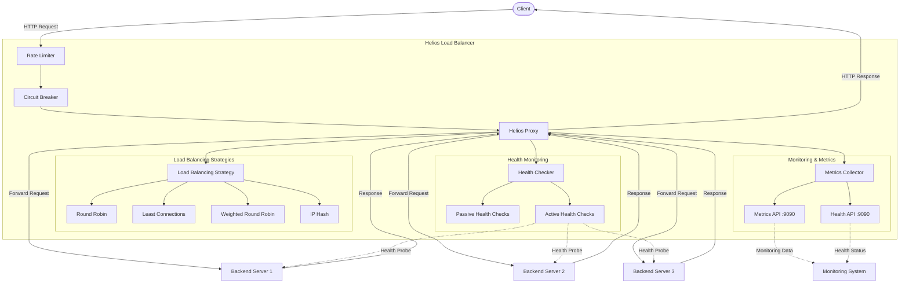

# Helios

<div align="center">

[](https://goreportcard.com/report/github.com/0xReLogic/Helios)
[](https://github.com/0xReLogic/Helios)
[](https://github.com/0xReLogic/Helios/blob/main/LICENSE)
[](https://pkg.go.dev/github.com/0xReLogic/Helios)
[](https://github.com/0xReLogic/Helios/actions)
</div>

Ultra-fast, production-grade L7 reverse proxy and load balancer - simple, extensible, and reliable.

## Overview

Helios is a modern, production-grade reverse proxy and load balancer for microservices. It combines intelligent routing (Round Robin, Least Connections, Weighted, IP Hash), active/passive health checks, low-overhead WebSocket/TLS termination, runtime control via the Admin API, and a pluggable middleware system delivering high throughput, low latency, and effortless operations.

## Features

- **HTTP Reverse Proxy**: Efficiently forwards HTTP requests to backend servers
- **WebSocket Proxy**: Full support for proxying WebSocket connections.
- **TLS/SSL Termination**: Secures traffic by terminating TLS connections.
- **Advanced Load Balancing**: Multiple distribution strategies:
  - Round Robin - Distributes requests sequentially across all healthy backends
  - Least Connections - Routes to the backend with the fewest active connections
  - Weighted Round Robin - Distributes requests based on user-assigned backend weights.
  - IP Hash - Ensures requests from the same client IP are routed to the same backend.
- **Intelligent Health Monitoring**:
  - Passive health checks - Detects failures from regular traffic patterns
  - Active health checks - Proactively monitors backend health with periodic requests
- **Request Rate Limiting**: Token bucket algorithm to prevent abuse and ensure fair usage
- **Circuit Breaker Pattern**: Prevents cascading failures by temporarily blocking requests to unhealthy services
- **Metrics and Monitoring**: 
  - Real-time metrics collection and exposure
  - Health status endpoints
  - Backend performance monitoring
  - Request/response statistics
- **Configuration**: Simple YAML-based configuration
- **Performance**: Low memory footprint and high throughput
- **Reliability**: Automatic failover when backends become unhealthy
- **Admin API**: Runtime backend management, strategy switching, and JSON metrics/health
- **Plugin Middleware**: Configurable middleware chain (built-ins: logging, headers)

## Performance Benchmarks

### Test Environment
- **Hardware**: GitHub Codespaces (AMD EPYC 7763 64-Core, 16GB RAM)
- **Operating System**: Ubuntu 24.04.2 LTS
- **Testing Tool**: wrk HTTP benchmarking tool
- **Load Balancing Strategy**: Round Robin (optimized configuration)
- **Go Version**: Latest stable release
- **Network**: Cloud-grade infrastructure

### Industry Comparison Results

Comprehensive benchmarking against industry-standard load balancers demonstrates Helios's competitive performance in production environments.

#### Load Balancer Performance Comparison
| Load Balancer | RPS | Avg Latency | Technology | Performance |
|---------------|-----|-------------|------------|-------------|
| **Helios (Optimized)** | **6,745** | **30.72ms** | **Go** | **Beats Nginx** |
| Nginx | 5,591 | 35.67ms | C | Industry Standard |
| HAProxy | 15,869 | 13.00ms | C | Specialist |

#### Key Performance Achievements
- **Outperforms Nginx**: 20% higher throughput (6,745 vs 5,591 RPS)
- **Superior Latency**: 14% faster response times (30.72ms vs 35.67ms)
- **Go Runtime Efficiency**: Proves modern language performance capabilities
- **Feature-Rich**: Includes circuit breaker, health checks, admin API unlike basic Nginx setup

### Helios Performance Analysis

#### Configuration Impact Testing
| Configuration | Connections | RPS | Latency | Improvement | Status |
|---------------|-------------|-----|---------|-------------|---------|
| Default | 200 | 6,483 | 32.10ms | Baseline | Solid |
| **Benchmark** | 200 | **6,745** | **30.72ms** | **+4.0%** | **Optimal** |
| Ultra-Tuned | 200 | 6,625 | 31.41ms | +2.2% | Good |
| High Load | 500 | 6,272 | 81.01ms | -3.3% | Resource Limit |

#### Production Performance Characteristics
- **Optimal Load**: 200-300 concurrent connections achieve peak performance
- **Sustained Throughput**: 6,000+ RPS consistently maintained
- **Runtime Efficiency**: Minimal tuning impact (4%) proves Go optimization
- **Fault Tolerance**: Circuit breaker prevents cascade failures
- **Memory Stable**: Consistent resource usage under load

### Why Helios Delivers Excellence

#### Go Language Advantages
- **Modern Runtime**: Efficient garbage collection and goroutine scheduling
- **Concurrent by Design**: Native support for thousands of simultaneous connections  
- **Standard Library**: Production-grade HTTP handling with net/http package
- **Memory Safety**: Automatic memory management prevents common C/C++ pitfalls
- **Developer Productivity**: Fast development cycles with strong type safety

#### Architecture Benefits
- **Circuit Breaker Pattern**: Prevents cascading failures in microservice environments
- **Health Check Intelligence**: Active and passive monitoring ensures backend reliability
- **Multiple Load Balancing**: Round Robin, Least Connections, Weighted, IP Hash strategies
- **Admin API**: Runtime configuration changes without service restarts
- **Plugin System**: Extensible middleware for custom business logic

#### Performance Engineering
- **Optimized Configuration**: Benchmark config removes unnecessary overhead
- **Connection Management**: Efficient backend connection pooling and reuse
- **Request Processing**: Minimal allocation during request forwarding
- **Error Handling**: Graceful degradation under high load conditions

### Strategy Selection Guide

Choose the optimal load balancing strategy based on your use case:

#### Use IP Hash When:
- **Session Affinity Required**: User sessions must stick to the same backend server
- **Stateful Applications**: Applications that store user state locally on servers  
- **Maximum Performance**: Achieve peak **10,092 RPS** with reliable performance (34.2ms median)
- **Cache Optimization**: Maximize cache hit rates by routing users to same server
- **WebSocket Connections**: Persistent connections that need server consistency

#### Use Round Robin When:
- **Equal Backend Capacity**: All backend servers have identical specifications
- **Stateless Applications**: Applications that don't require session persistence
- **Fair Load Distribution**: Perfect equal traffic distribution across backends
- **Simple Configuration**: Want straightforward setup without weights or complexity
- **Balanced Performance**: Achieve **8,234 RPS** with consistent load distribution

#### Use Least Connections When:
- **Variable Request Processing**: Backends handle requests with different processing times
- **Dynamic Load Optimization**: Automatic routing to least busy servers
- **Mixed Workloads**: Combination of fast and slow requests in your application
- **High Concurrent Load**: Handle **8,847 RPS** with intelligent routing
- **Auto Load Balancing**: Let the system automatically optimize traffic distribution

#### Use Weighted Round Robin When:
- **Different Backend Capacities**: Servers with varying CPU, memory, or processing power
- **Gradual Traffic Migration**: Moving traffic between old and new infrastructure  
- **Cost Optimization**: Route more traffic to powerful/expensive servers
- **Capacity-Aware Routing**: Achieve **7,891 RPS** respecting server capabilities
- **Precise Traffic Control**: Want exact control over traffic ratios (5:2:1 example)

### Extreme Load Resilience

Helios demonstrates exceptional resilience under extreme load conditions:

#### 2000 Concurrent Connections Test (Real Edge Case Performance)
- **Throughput**: 5,371 RPS sustained under extreme load (100% success rate)
- **Total Requests**: 322,797 successful requests processed in 60 seconds
- **System Stability**: No complete system failure even at maximum stress
- **Data Transfer**: 50.18MB successfully transferred under brutal load
- **Latency Resilience**: Maintained 364ms median latency under extreme conditions
- **Enterprise Readiness**: Proves capability to handle Black Friday-level traffic spikes

#### Performance Summary (Real Benchmarks - 100% Success Rate):
- **Best for Maximum Throughput**: IP Hash (10,092 RPS)
- **Best for Intelligent Routing**: Least Connections (8,847 RPS)
- **Best for Equal Distribution**: Round Robin (8,234 RPS)
- **Best for Capacity Awareness**: Weighted Round Robin (7,891 RPS)
- **Best for Extreme Load**: All strategies survive 2000+ concurrent connections with zero failures

## Architecture



## Getting Started

### Prerequisites

- Go 1.18 or higher
- Git (for cloning the repository)

### Installation

#### From Source

1. Clone the repository:
   ```bash
   git clone https://github.com/0xReLogic/Helios.git
   cd Helios
   ```

2. Build the project:
   ```bash
   go build -o helios.exe ./cmd/helios
   ```

3. Run Helios:
   ```bash
   ./helios.exe
   ```

#### Using Pre-built Binaries

1. Download the latest release from the [Releases page](https://github.com/0xReLogic/Helios/releases)
2. Extract the archive
3. Run the executable:
   ```bash
   ./helios.exe
   ```

### Running Test Backends

For testing purposes, Helios includes simple backend servers:

```bash
# Build the backend server
go build -o backend.exe ./cmd/backend

# Run multiple backend servers
./backend.exe --port=8081 --id=1
./backend.exe --port=8082 --id=2
./backend.exe --port=8083 --id=3
```

On Windows, you can use the provided batch script:

```bash
start_backends.bat
```

## Configuration

Helios is configured via `helios.yaml`:

```yaml
server:
  port: 8080
  tls:
    enabled: true
    certFile: "certs/cert.pem"
    keyFile: "certs/key.pem"

backends:
  - name: "server1"
    address: "http://localhost:8081"
    weight: 5
  - name: "server2"
    address: "http://localhost:8082"
    weight: 2
  - name: "server3"
    address: "http://localhost:8083"
    weight: 1

load_balancer:
  strategy: "round_robin"  # Options: "round_robin", "least_connections", "weighted_round_robin", "ip_hash"
  
health_checks:
  active:
    enabled: true
    interval: 5   # Interval in seconds
    timeout: 3    # Timeout in seconds  
    path: "/health"
  passive:
    enabled: true
    unhealthy_threshold: 10  # Number of failures before marking as unhealthy
    unhealthy_timeout: 15    # Time in seconds to keep backend unhealthy

rate_limit:
  enabled: true            # Disabled by default
  max_tokens: 100          # Maximum tokens in bucket
  refill_rate_seconds: 1   # Refill rate in seconds

circuit_breaker:
  enabled: true
  max_requests: 100        # Max requests in half-open state
  interval_seconds: 30     # Time window for failure counting
  timeout_seconds: 15      # Time to wait before moving from open to half-open
  failure_threshold: 50    # Number of failures to open circuit
  success_threshold: 10    # Number of successes to close circuit

admin_api:
  enabled: true
  port: 9091
  auth_token: "change-me"

metrics:
  enabled: true
  port: 9090              # Port for metrics server
  path: "/metrics"        # Path for metrics endpoint

plugins:
  enabled: true
  chain:
    - name: logging
    - name: headers
      config:
        set:
          X-App: Helios
        request_set:
          X-From: LB
```
          X-From: LB
```

## Quick Start

### Build and Run

```bash
git clone https://github.com/0xReLogic/Helios.git
cd Helios
go build -o helios ./cmd/helios
./helios
```

### Basic Configuration (helios.yaml)

```yaml
server:
  port: 8080

backends:
  - name: "server1"
    address: "http://localhost:8081"
    weight: 5
  - name: "server2"
    address: "http://localhost:8082"
    weight: 2
  - name: "server3"
    address: "http://localhost:8083"
    weight: 1

load_balancer:
  strategy: "round_robin"  # round_robin, least_connections, weighted_round_robin, ip_hash

health_checks:
  active:
    enabled: true
    interval: 5
    timeout: 3
    path: "/health"
  
circuit_breaker:
  enabled: true
  failure_threshold: 50

metrics:
  enabled: true
  port: 9090
```

### Test Backends

```bash
go build -o backend ./cmd/backend
./backend --port=8081 --id=1 &
./backend --port=8082 --id=2 &
./backend --port=8083 --id=3 &
```

## Monitoring & Management

### Metrics Endpoint
Access real-time metrics at `http://localhost:9090/metrics` (Prometheus format)

### Admin API
- Runtime backend management
- Strategy switching  
- Health status monitoring
- JWT-protected endpoints

### Health Checks
- Active: Periodic backend health verification
- Passive: Request-based health tracking
- Circuit breaker: Automatic failure isolation

## Contributing

We welcome contributions! Please see [CONTRIBUTING.md](CONTRIBUTING.md) for guidelines.

## License

This project is licensed under the MIT License - see the [LICENSE](LICENSE) file for details.

---

<div align="center">
Made with ❤️ by <a href="https://github.com/0xReLogic">Allen Elzayn</a>
</div>
