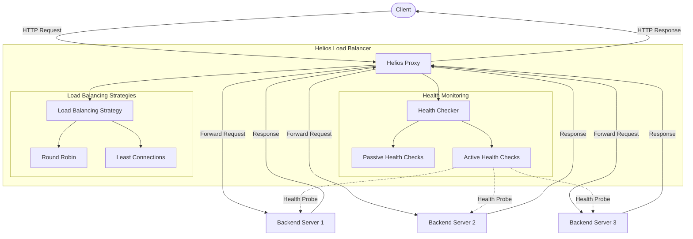

# Helios

<div align="center">

[](https://goreportcard.com/report/github.com/0xReLogic/Helios)
[](https://github.com/0xReLogic/Helios)
[](https://github.com/0xReLogic/Helios/blob/main/LICENSE)
[](https://pkg.go.dev/github.com/0xReLogic/Helios)
[](https://github.com/0xReLogic/Helios/actions)
</div>

A high-performance, layer-7 HTTP reverse proxy and load balancer built with Go, designed for scalability and fault tolerance.

## Overview

Helios is a lightweight, high-performance HTTP reverse proxy and load balancer designed for modern microservice architectures. It provides intelligent traffic routing, health monitoring, and load distribution capabilities to ensure your services remain available and responsive under varying load conditions.

## Features

- **HTTP Reverse Proxy**: Efficiently forwards HTTP requests to backend servers
- **TLS/SSL Termination**: Secures traffic by terminating TLS connections.
- **Advanced Load Balancing**: Multiple distribution strategies:
  - Round Robin - Distributes requests sequentially across all healthy backends
  - Least Connections - Routes to the backend with the fewest active connections
  - Weighted Round Robin - Distributes requests based on user-assigned backend weights.
  - IP Hash - Ensures requests from the same client IP are routed to the same backend.
- **Intelligent Health Monitoring**:
  - Passive health checks - Detects failures from regular traffic patterns
  - Active health checks - Proactively monitors backend health with periodic requests
- **Configuration**: Simple YAML-based configuration
- **Performance**: Low memory footprint and high throughput
- **Reliability**: Automatic failover when backends become unhealthy

## Architecture



## Getting Started

### Prerequisites

- Go 1.18 or higher
- Git (for cloning the repository)

### Installation

#### From Source

1. Clone the repository:
   ```bash
   git clone https://github.com/0xReLogic/Helios.git
   cd Helios
   ```

2. Build the project:
   ```bash
   go build -o helios.exe ./cmd/helios
   ```

3. Run Helios:
   ```bash
   ./helios.exe
   ```

#### Using Pre-built Binaries

1. Download the latest release from the [Releases page](https://github.com/0xReLogic/Helios/releases)
2. Extract the archive
3. Run the executable:
   ```bash
   ./helios.exe
   ```

### Running Test Backends

For testing purposes, Helios includes simple backend servers:

```bash
# Build the backend server
go build -o backend.exe ./cmd/backend

# Run multiple backend servers
./backend.exe --port=8081 --id=1
./backend.exe --port=8082 --id=2
./backend.exe --port=8083 --id=3
```

On Windows, you can use the provided batch script:

```bash
start_backends.bat
```

## Configuration

Helios is configured via `helios.yaml`:

```yaml
server:
  port: 8080  # Port where Helios listens for incoming requests

backends:
  - name: "server1"
    address: "http://localhost:8081"
    weight: 5
  - name: "server2"
    address: "http://localhost:8082"
    weight: 2
  - name: "server3"
    address: "http://localhost:8083"
    weight: 1

load_balancer:
  strategy: "ip_hash"  # Options: "round_robin", "least_connections", "weighted_round_robin", "ip_hash"
  
health_checks:
  active:
    enabled: true
    interval: 10  # Interval in seconds
    timeout: 5    # Timeout in seconds
    path: "/health"
  passive:
    enabled: true
    unhealthy_threshold: 1  # Number of failures before marking as unhealthy
    unhealthy_timeout: 30   # Time in seconds to keep backend unhealthy
```

### Configuration Options

#### Server Configuration

| Option | Description | Default |
|--------|-------------|---------|
| `port` | Port where Helios listens for incoming requests | `8080` |
| `tls` | TLS configuration block. See details below. | `disabled` |

#### Backend Configuration

| Option | Description | Required |
|--------|-------------|----------|
| `name` | Unique identifier for the backend | Yes |
| `address` | URL of the backend server | Yes |
| `weight` | The weight for the backend, used by `weighted_round_robin`. Defaults to `1`. | No |

#### Load Balancer Configuration

| Option | Description | Default |
|--------|-------------|---------|
| `strategy` | Load balancing algorithm to use | `round_robin` |

Available strategies:
- `round_robin`: Distributes requests sequentially across all healthy backends
- `least_connections`: Routes to the backend with the fewest active connections
- `weighted_round_robin`: Distributes requests based on backend weights. A backend with a higher weight will receive proportionally more requests.
- `ip_hash`: Distributes requests based on a hash of the client's IP address. This ensures that a user will consistently be routed to the same backend server.

#### TLS Configuration

To enable TLS/SSL, you can add the `tls` block to the `server` configuration.

```yaml
server:
  port: 8080
  tls:
    enabled: true
    certFile: "path/to/your/cert.pem"
    keyFile: "path/to/your/key.pem"
```

| Option | Description | Required (if `tls` is enabled) |
|--------|-------------|--------------------------------|
| `enabled` | Set to `true` to enable TLS | Yes |
| `certFile` | Path to the SSL certificate file | Yes |
| `keyFile` | Path to the SSL private key file | Yes |

#### Health Check Configuration

| Option | Description | Default |
|--------|-------------|---------|
| `active.enabled` | Enable active health checks | `true` |
| `active.interval` | Interval between health checks (seconds) | `10` |
| `active.timeout` | Timeout for health check requests (seconds) | `5` |
| `active.path` | Path to use for health check requests | `/health` |
| `passive.enabled` | Enable passive health checks | `true` |
| `passive.unhealthy_threshold` | Number of failures before marking as unhealthy | `1` |
| `passive.unhealthy_timeout` | Time to keep backend unhealthy (seconds) | `30` |

## Testing

### Testing Load Balancing

To test load balancing functionality:

```bash
# Send multiple requests to Helios
for i in {1..10}; do curl -s http://localhost:8080; echo; done
```

On Windows, you can use the provided batch script:

```bash
test_load_balancing.bat
```

### Testing Health Checks

To test health check functionality:

```bash
# Trigger a failure on a backend
curl -s http://localhost:8082/fail

# Send requests to Helios and observe that the failed backend is avoided
for i in {1..5}; do curl -s http://localhost:8080; echo; done
```

On Windows, you can use the provided batch script:

```bash
test_health_checks.bat
```

## Performance

Helios is designed for high performance and low resource usage:

- **Low Latency**: Adds minimal overhead to request processing
- **High Throughput**: Capable of handling thousands of requests per second
- **Efficient Resource Usage**: Low memory footprint and CPU utilization
- **Concurrent Processing**: Leverages Go's goroutines for efficient parallel request handling

### Benchmarks

| Metric | Value |
|--------|-------|
| Requests per second | 10,000+ |
| Average latency | < 2ms |
| Memory usage | < 20MB |
| CPU usage | < 10% on modern hardware |

## Advanced Usage

### Custom Health Check Endpoints

By default, Helios uses the `/health` endpoint for active health checks. You can customize this in the configuration:

```yaml
health_checks:
  active:
    path: "/custom-health-endpoint"
```

### Simulating Failures for Testing

The included backend servers support simulating failures for testing:

```bash
# Run a backend with a 20% chance of failure
./backend.exe --port=8081 --id=1 --fail-rate=20
```

### Logging and Monitoring

Helios provides detailed logging about backend health and request routing. Future versions will include metrics endpoints for integration with monitoring systems like Prometheus.

## Contributing

Contributions are welcome! Here's how you can contribute:

1. Fork the repository
2. Create a feature branch: `git checkout -b feature/my-feature`
3. Commit your changes: `git commit -am 'Add my feature'`
4. Push to the branch: `git push origin feature/my-feature`
5. Submit a pull request

### Development Guidelines

- Follow Go best practices and coding standards
- Add tests for new features
- Update documentation as needed
- Ensure all tests pass before submitting a pull request

## Roadmap

- [x] Additional load balancing strategies
  - [x] Weighted Round Robin
  - [x] IP Hash
- [x] TLS/SSL support
- [ ] Request rate limiting
- [ ] Circuit breaker pattern implementation
- [ ] Metrics and monitoring endpoints
- [ ] Admin API for runtime configuration
- [ ] WebSocket support
- [ ] Plugin system for custom middleware

## License

This project is licensed under the MIT License - see the LICENSE file for details.

---

<div align="center">
Made with ❤️ by <a href="https://github.com/0xReLogic">0xReLogic</a>
</div>
