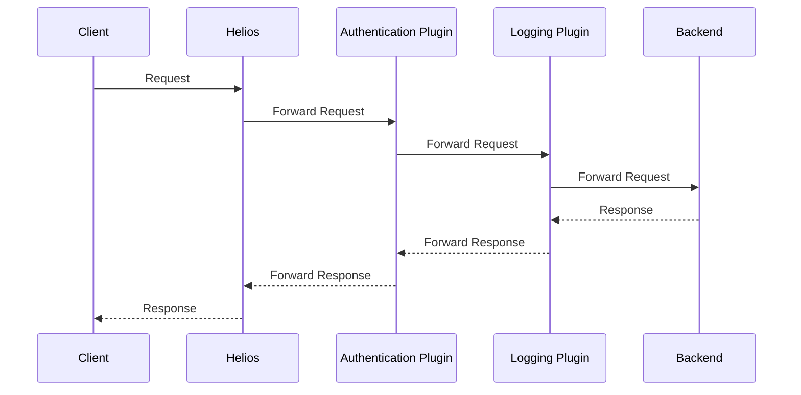

# Helios Plugin System Documentation

## 1. Introduction

### What are Helios Plugins?
Helios plugins are self-contained middleware components that intercept and modify HTTP requests and responses flowing through the Helios Gateway. They provide a powerful mechanism to add cross-cutting functionality—such as logging, authentication, rate limiting, and caching—without altering core application logic.

By making use of plugins, you can keep your gateway's architecture clean, modular, and easy to maintain.

### Plugin Lifecycle and Execution Order

The plugin lifecycle is designed for predictability and control.

1.  **Registration**: When Helios starts, each plugin's `init()` function is called, registering a **factory function** with the central plugin registry.
2.  **Instantiation**: The gateway reads the `helios.yaml` configuration and uses the factory functions to create instances of each configured plugin.
3.  **Execution**: When a request arrives, it travels through the plugin chain in the exact order defined in the configuration.

The execution order is crucial. The **first** plugin in your configuration is the **outermost** layer—it's the first to process a request and the last to process the response. An example request and response flow diagram with two plugins is shown below.



### When to Use Plugins

Plugins are ideal for implementing features that are not specific to a single backend service, often called "cross-cutting concerns." Common use cases include:

-   **Security**: Implement API key validation, JWT verification, or role-based access control at the edge.
-   **Observability**: Add consistent logging, metrics, and tracing to all traffic.
-   **Traffic Shaping**: Enforce rate limiting or block malicious actors by IP address.
-   **Request/Response Transformation**: Add or remove headers, or modify the request path before forwarding.

---

## 2. Getting Started

### Plugin Interface Requirements

A Helios plugin is a standard Go HTTP middleware created by a factory function.

-   **Middleware Type (`plugins.Middleware`)**: A function that takes the next `http.Handler` in the chain and returns a new `http.Handler`.
    ```go
    type Middleware func(next http.Handler) http.Handler
    ```
-   **Factory Type (`plugins.factory`)**: A function that takes the plugin's name and configuration map and returns a `Middleware`.
    ```go
    type factory func(name string, cfg map[string]interface{}) (Middleware, error)
    ```

### Directory Structure

All plugins reside in the `internal/plugins/` directory. To create a new plugin, add your file to this directory.

```
internal/
└── plugins/
    ├── headers.go
    ├── logging.go
    └── registry.go
```

You may use subdirectories in order to organize complex plugins. For exmaple, `internal/plugins/myplugin/`.

### Configuration Schema

Plugin configuration is managed in `helios.yaml` under the `plugins` key.

-   `enabled` (boolean): Enables or disables the plugin system.
-   `chain` (array): A list of plugin objects to execute in order.
    -   `name` (string): The registered name of the plugin.
    -   `config` (map, optional): Plugin-specific configuration (explained later).

**Example `helios.yaml`:**
```yaml
plugins:
  enabled: true
  chain:
    - name: headers
      config:
        set:
          X-Powered-By: "Helios Gateway"
    - name: logging
```