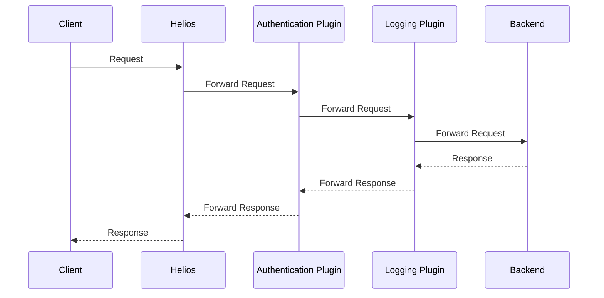

# Helios Plugin System Documentation

## 1. Introduction

### What are Helios Plugins?
Helios plugins are self-contained middleware components that intercept and modify HTTP requests and responses flowing through the Helios Gateway. They provide a powerful mechanism to add cross-cutting functionality—such as logging, authentication, rate limiting, and caching—without altering core application logic.

By making use of plugins, you can keep your gateway's architecture clean, modular, and easy to maintain.

### Plugin Lifecycle and Execution Order

The plugin lifecycle is designed for predictability and control.

1.  **Registration**: When Helios starts, each plugin's `init()` function is called, registering a **factory function** with the central plugin registry.
2.  **Instantiation**: The gateway reads the `helios.yaml` configuration and uses the factory functions to create instances of each configured plugin.
3.  **Execution**: When a request arrives, it travels through the plugin chain in the exact order defined in the configuration.

The execution order is crucial. The **first** plugin in your configuration is the **outermost** layer—it's the first to process a request and the last to process the response. An example request and response flow diagram with two plugins is shown below.



### When to Use Plugins

Plugins are ideal for implementing features that are not specific to a single backend service, often called "cross-cutting concerns." Common use cases include:

-   **Security**: Implement API key validation, JWT verification, or role-based access control at the edge.
-   **Observability**: Add consistent logging, metrics, and tracing to all traffic.
-   **Traffic Shaping**: Enforce rate limiting or block malicious actors by IP address.
-   **Request/Response Transformation**: Add or remove headers, or modify the request path before forwarding.

---

## 2. Getting Started

### Plugin Interface Requirements

A Helios plugin is a standard Go HTTP middleware created by a factory function.

-   **Middleware Type (`plugins.Middleware`)**: A function that takes the next `http.Handler` in the chain and returns a new `http.Handler`.
    ```go
    type Middleware func(next http.Handler) http.Handler
    ```
-   **Factory Type (`plugins.factory`)**: A function that takes the plugin's name and configuration map and returns a `Middleware`.
    ```go
    type factory func(name string, cfg map[string]interface{}) (Middleware, error)
    ```

### Directory Structure

All plugins reside in the `internal/plugins/` directory. To create a new plugin, add your file to this directory.

```
internal/
└── plugins/
    ├── headers.go
    ├── logging.go
    └── registry.go
```

You may use subdirectories in order to organize complex plugins. For example, `internal/plugins/myplugin/`.

### Configuration Schema

Plugin configuration is managed in `helios.yaml` under the `plugins` key.

-   `enabled` (boolean): Enables or disables the plugin system.
-   `chain` (array): A list of plugin objects to execute in order.
    -   `name` (string): The registered name of the plugin.
    -   `config` (map, optional): Plugin-specific configuration (explained later).

**Example `helios.yaml`:**
```yaml
plugins:
  enabled: true
  chain:
    - name: headers
      config:
        set:
          X-Powered-By: "Helios Gateway"
    - name: logging
```

## 3. Plugin API Reference

### Plugin Interface Methods

-   **`plugins.RegisterBuiltin(name string, f factory)`**: Registers a new plugin. This function should be called from the `init()` function of your plugin file.
-   **`http.Handler.ServeHTTP(w http.ResponseWriter, r *http.Request)`**: The core method for handling requests. Your plugin will call `next.ServeHTTP(w, r)` to pass control to the next middleware.

### Request/Response Context

You can modify the request and response directly within your plugin:

-   **Request**: Modify headers with `r.Header.Set("X-My-Header", "value")`.
-   **Response**: Modify headers with `w.Header().Set("X-My-Header", "value")`. Note that response headers must be set *before* `next.ServeHTTP` is called if you want them to be available to downstream middleware.

### Configuration Loading

The `cfg map[string]interface{}` passed to your factory function contains the raw, unmarshaled configuration from `helios.yaml`. It is your responsibility to parse and validate this map.

### Error Handling

If your factory function encounters an invalid configuration, it should return an error. This will prevent Helios from starting and provide clear feedback to the user.

```go
func MyPluginFactory(name string, cfg map[string]interface{}) (Middleware, error) {
    apiKey, ok := cfg["apiKey"].(string)
    if !ok || apiKey == "" {
        return nil, fmt.Errorf("apiKey is required for plugin %s", name)
    }
    // ...
    return middleware, nil
}
```
---

## 4. Tutorial : Building Your First Plugin

Let's build a `request-id` plugin that adds a unique ID to every request and response.

### Step 1: Create the Plugin File

Create a new file: `internal/plugins/request_id.go`.

### Step 2: Write the Plugin Code

```go
package plugins

import (
	"crypto/rand"
	"encoding/hex"
	"fmt"
	"net/http"
)

func init() {
	RegisterBuiltin("request-id", func(name string, cfg map[string]interface{}) (Middleware, error) {
		// This plugin has no configuration, so the factory is simple.
		return func(next http.Handler) http.Handler {
			return http.HandlerFunc(func(w http.ResponseWriter, r *http.Request) {
				// 1. Generate a unique request ID
				b := make([]byte, 16)
				if _, err := rand.Read(b); err != nil {
					// Log the error and proceed without a request ID for this request
					fmt.Printf("Error generating request ID: %v\n", err)
					next.ServeHTTP(w, r)
					return
				}
				requestID := hex.EncodeToString(b)

				// 2. Add the ID to the request header
				r.Header.Set("X-Request-ID", requestID)

				// 3. Add the ID to the response header
				w.Header().Set("X-Request-ID", requestID)

				// 4. Call the next handler in the chain
				next.ServeHTTP(w, r)
			})
		}, nil
	})
}
```

### Code Walkthrough

1.  **`init()`**: We register our plugin with the name `request-id`.
2.  **Factory**: Our factory is simple because this plugin doesn't require configuration. It returns the middleware directly.
3.  **Middleware**:
    -   We generate a new UUID for each request.
    -   We use `r.Header.Set` to add the ID to the incoming request.
    -   We use `w.Header().Set` to add the same ID to the outgoing response.
    -   Finally, we call `next.ServeHTTP` to continue the request chain.

### Step 3: Add to Configuration

Enable the plugin in your `helios.yaml`:

```yaml
plugins:
  enabled: true
  chain:
    - name: request-id
    - name: logging
```

### Step 4: Testing the Plugin

Run Helios and make a request. You should see the `X-Request-ID` header in both the request received by your backend and the response received by the client.

---

## 5. Advanced Topics

### State Management

Plugins can maintain state using Go closures within their factory functions. Variables declared in the factory's scope (outside the returned `Middleware` or `http.HandlerFunc`) are "closed over" and persist for the plugin instance's lifetime, accessible by all requests processed by that instance.

**Key Considerations:**

*   **Thread Safety**: When multiple concurrent requests access shared state, use synchronization primitives like `sync.Mutex` to prevent race conditions.
*   **Cleanup**: For state that accumulates over time (e.g., request logs, caches), implement periodic cleanup mechanisms (e.g., a background goroutine with `time.Tick`) to manage memory usage.

**Example: Simple Request Counter**

This example demonstrates a basic request counter per remote IP address.

```go
func init() {
    RegisterBuiltin("my-plugin", func(name string, cfg map[string]interface{}) (Middleware, error) {
        // State stored in closure, protected by a mutex
        var mu sync.Mutex
        state := make(map[string]int) // Maps IP to request count
        
        return func(next http.Handler) http.Handler {
            return http.HandlerFunc(func(w http.ResponseWriter, r *http.Request) {
                mu.Lock()
                state[r.RemoteAddr]++ // Increment count for the client's IP
                // Optionally, log or use the state for logic (e.g., rate limiting)
                mu.Unlock()
                next.ServeHTTP(w, r)
            })
        }, nil
    })
}
```

This approach allows plugins to implement complex logic requiring persistent data across requests, such as rate limiting, authentication session tracking, or custom metrics collection.

### Performance Considerations

Although Helios is one of the fastest gateways in the market, you may consider these best practices to improve performance.

*   **Avoid Blocking Operations**: Middleware functions execute synchronously in the request path. Avoid long-running or blocking operations (e.g., complex database queries, external API calls without timeouts) directly within the `http.HandlerFunc`. If such operations are necessary, consider offloading them.
*   **Asynchronous Work with Goroutine Pools**: For tasks that can be performed asynchronously (e.g., sending logs to a remote service, non-critical metrics collection), use goroutines. To manage resource consumption and prevent unbounded goroutine creation, consider implementing or utilizing a goroutine pool.
*   **Minimize Allocations**: Go's garbage collector can introduce pauses. Reduce memory pressure by minimizing allocations within the hot path of your middleware. This includes:
    *   **Reusing Buffers**: For I/O operations, reuse byte buffers where possible.
    *   **Avoiding Unnecessary Copies**: Be mindful of data structures that might cause implicit copies.
*   **Efficient `http.ResponseWriter` Wrapping**: When you need to inspect or modify the HTTP response (e.g., capture status codes or body content), you often need to wrap the `http.ResponseWriter`. The `internal/plugins/logging.go` plugin provides a good example of an efficient `statusRecorder` that wraps the `http.ResponseWriter` to capture the status code without excessive overhead, while also correctly implementing `http.Hijacker` and `http.Flusher` interfaces for compatibility.

### Integration with Metrics (Future)

Plugins will eventually have the ability to integrate with Helios's global metrics collector to emit custom metrics, providing deeper insights into plugin-specific behavior and performance. This allows for a unified observability strategy across the gateway and its extensions.

The general pattern for integrating with metrics will involve:

1.  **Importing the Metrics Package**:
    ```go
    import "github.com/0xReLogic/Helios/internal/metrics"
    ```
2.  **Accessing the Metrics Recorder**: Within your middleware, you would obtain a metrics recorder instance.
    ```go
    // In the middleware
    recorder := metrics.GetRecorder() // if exposed
    ```
3.  **Emitting Metrics**: Use the recorder to increment counters, record histograms, or set gauges.
    ```go
    recorder.IncrementCounter("plugin_requests")
    // recorder.ObserveHistogram("plugin_latency_ms", durationMs)
    ```

**Note**: At present, the metrics API is not directly exposed for plugin consumption. These are considered future integration points, and the exact API may evolve. This documentation serves to outline the intended pattern for when this functionality becomes available.

### Testing Strategies

Effective testing is crucial for ensuring the reliability and correctness of your Helios plugins. This section outlines a common pattern for writing unit tests for plugins, leveraging Go's built-in `testing` package and `net/http/httptest` for simulating HTTP interactions.

#### Example Test Structure


```go
func TestMyPlugin(t *testing.T) {
    // 1. Create a mock 'next' HTTP handler
    // This handler simulates the behavior of the next component in the middleware chain
    // (e.g., another plugin or the backend service).
    handler := http.HandlerFunc(func(w http.ResponseWriter, r *http.Request) {
        // For this example, we simply write a 200 OK status.
        // In a real test, you might assert request headers, body, or path
        // that your plugin is expected to modify before passing it down.
        w.WriteHeader(http.StatusOK)
    })
    
    // 2. Instantiate your plugin's middleware
    // Call your plugin's factory function with a test name and any required configuration.
    // The 'factory' function here is a placeholder for your actual plugin factory.
    mw, err := factory("test-plugin", map[string]interface{}{
        // "configKey": "configValue", // Add any necessary plugin configuration
    })
    if err != nil {
        t.Fatalf("failed to create plugin middleware: %v", err)
    }
    
    // 3. Prepare a test HTTP request and response recorder
    // `httptest.NewRequest` creates a synthetic incoming request.
    // `httptest.NewRecorder` captures the response written by your plugin.
    req := httptest.NewRequest("GET", "/test-path", nil)
    // Optionally, add headers or a body to the request if your plugin processes them.
    // req.Header.Set("X-Test-Header", "value")

    rec := httptest.NewRecorder()
    
    // 4. Execute the plugin middleware
    // Your plugin's middleware (mw) is applied to the mock handler.
    // The combined handler then serves the test request, writing to the recorder.
    mw(handler).ServeHTTP(rec, req)
    
    // 5. Assert the outcomes
    // Check the recorded response for expected status codes, headers, or body content.
    if rec.Code != http.StatusOK {
        t.Errorf("expected status %d, got %d", http.StatusOK, rec.Code)
    }
    // Example: Assert a header set by your plugin
    // if rec.Header().Get("X-Plugin-Header") != "expected-value" {
    //     t.Errorf("expected X-Plugin-Header 'expected-value', got '%s'", rec.Header().Get("X-Plugin-Header"))
    // }
}
```

By following this pattern, you can write robust and isolated tests for your Helios plugins, ensuring they function correctly under various conditions and configurations.

## 6. Example Plugins
You can try out the example plugins in `internal/plugins/` directory. The plugins with `example_` prefix are example plugins.
